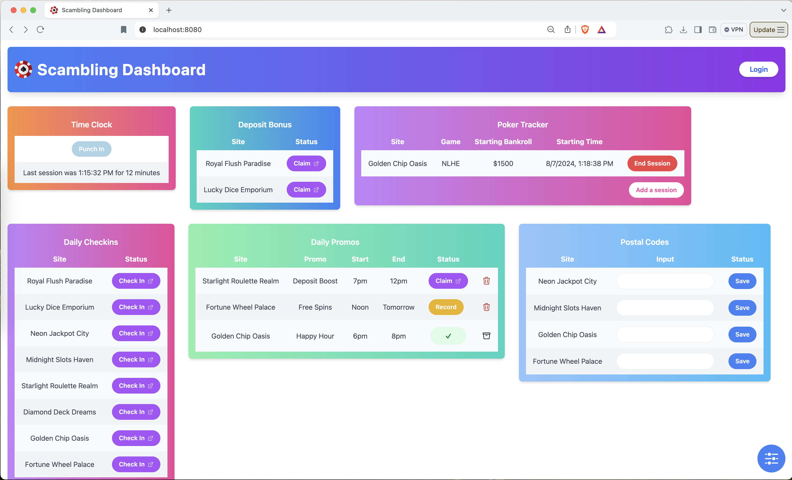

# Scambling

**Definition:** Small stakes gambling with an advantage due to bonuses or clever strategies.
This project aims to help you scamble more efficiently and track your winnings.



Check out the [demo](https://scambling.vercel.app/) to see the project in action.

## Background

Online gambling is a multi-billion dollar industry. Gambling websites make money because on each dollar players wager, the site has a small advantage. Sites market to players by occasionally offering games, promotions, or bonuses that tilt the playing field in the player's favor. When that happens, players can profit.

I have recently been curious about "How much money can someone make scambling?" and "Is it worth my time?" If I could make $100/day by putting in thirty minutes with my coffee in the morning and thirty minutes in the evening, I would say "It's worth it!"

This project aims to answer those questions.

## General

The application aims to both enable more efficient scambling and maintain accurate accounting. More efficiency will come from a user-friendly dashboard and simple automations behind the scenes. Accounting will come from tracking your time and recording your scambling activities.

The application is comprised of modules that can be enabled, disabled, added, or removed. Each module is self-contained. This architecture matches the variable nature of scambling.

## Technology Stack

The project has a few components:

1. Web Application ("The Dashboard") — VueJs hosted on Vercel
2. Realtime Database — Supabase
3. Module's Infrastructure — Lambda functions, S3 storage, and ActivePieces automations

### OpenAI's Structured Outputs

Yesterday (Aug 6, 2024), OpenAI released a feature that is going to change the world — Structured Outputs. This feature allows for you to make an API call to a LLM and know that you will get structured data back. This dramatically increases the usability and use cases for deep integrations of LLM's into applications.

I implemented this feature in the Daily Promotions Module!

```python
def llm_process_email(body):
    try:
        completion = client.chat.completions.create(
            model="gpt-4o-2024-08-06",
            messages=[
                {
                    'role': "system",
                    'content': f"Please determine the category and the start date of the email body provided below:"
                },
                {
                    'role': "user",
                    'content': body
                }
            ],
            response_format={
                'type': 'json_schema',
                'json_schema': {
                    'name': 'category_selection',
                    'schema': {
                        'type': 'object',
                        'properties': {
                            'category': {
                                'type': 'string',
                                'description': 'The category of the email body.',
                                'enum': ['Happy Hour Promotion', 'Free Spin Promotion', 'Deposit Bonus', 'Transaction', 'Support', 'New Game', 'General Marketing', 'It is unclear']
                            },
                            'start_date': {
                                'type': ['string', 'null'],
                                'description': 'The date and time the promotion starts.'
                            },
                            'end_date': {
                                'type': ['string', 'null'],
                                'description': 'The date and time the promotion ends.'
                            }
                        },
                        'required': ['category', 'start_date', 'end_date'],
                        'additionalProperties': False
                    },
                    'strict':True
                }
            }
        )
    except Exception as e:
        print(f"Error getting promo time. Error: {str(e)}")
        raise e

    return json.loads(completion.choices[0].message.content)

```

The code asks the LLM for the category of a promotional email along with the start and end date of the promotion. Structured Outputs allow for predictable responses that can then be used to trigger further logic, be stashed in a database, or to do any number of things in a way that was simply impossible with unstructured responses.

Implementation was very easy. See the [OpenAI docs](https://platform.openai.com/docs/guides/structured-outputs) for more info

## Modules

### Daily Check-ins

Sites offer a daily incentive to simply visit their site. This module helps to quickly claim these bonuses:

- List the sites
- Launch site in new tab
- Show availability by referencing your last check-in time
- Records bonus in DB

Note that different sites have different bonus schedules: some are on a 24-hour clock while others reset the bonus at a fixed time of day.

I estimate this is worth ~$10 a day and takes ~10 minutes.

### Postal Code Collection

Sweepstakes sites offer an Alternative Method of Entry (AMoE). Hand write a postcard with a unique code obtained from their site and they will credit your account with $3-$5 dollars. If you plan on writing more than one card, collecting the unique code is tedious, in part, because you have to wait a specified period of time before a new code is available — normally 5 minutes.

- Lists sites that you are writing postcard requests for
- Input the unique postal code to be saved to the DB
- Set a timer for when you can retrieve your next code

### Daily Promotions

Sites are constantly emailing you promotions. It is labor-intensive to read all the emails and decide if the promotion is worth your time. This seems like a good task for automation + LLMs!

1. Watch for promotional emails
2. Process the email to see if it is general marketing or if it contains a promotion
3. Use LLM to extract promotion details
4. Store the promotion in DB
5. List promotions in dashboard
6. View email containing promotion

### Timecard

Keep track of how long you scamble so you can know your hourly rate.

### MLB Bets

**Work in Progress**

Bet on sports with an advantage.

- Extracts BallPark Pals Runs Expectations
- Compares with lines from major sportsbooks
- Lists plus EV wagers
- Launch sportsbook in new tab
- Record your bets
- Results recorded in the background

## Todo

- [ ]  Add tooltips in module headers
- [ ]  Style with Masonry.js
- [ ]  Migrate from ActivePieces cloud to a hosted container
- [ ]  Add module to show earnings
